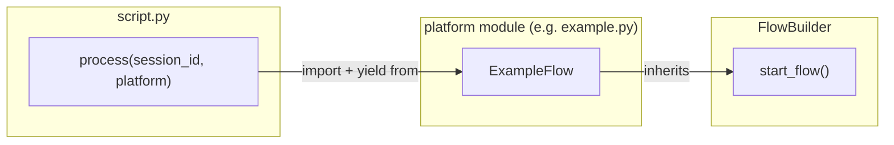
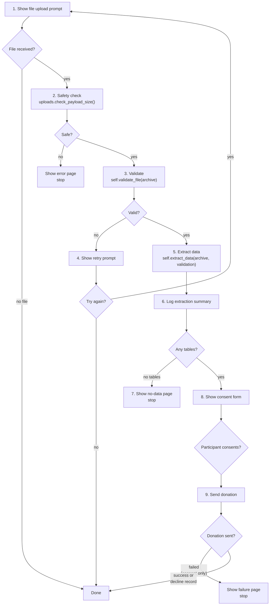

# FlowBuilder

`FlowBuilder` is the base class for every platform's donation flow. It handles the full lifecycle: asking the participant for a file, validating it, extracting data, showing a consent form, and sending the donation.

**File:** `packages/python/port/helpers/flow_builder.py`

---

## How it fits in

`script.py` receives the platform name (set via `VITE_PLATFORM`) and imports the matching platform module. It then calls `module.process(session_id)`, which creates a `FlowBuilder` subclass and starts the flow.



Each build runs exactly one platform. The platform is set at build time via the `VITE_PLATFORM` environment variable.

---

## The donation flow

`start_flow()` is a generator that runs a fixed sequence of steps. It loops so the participant can retry if they upload the wrong file.



---

## Log messages

`start_flow()` sends a short log message at each important step. These messages are always safe to send to the host — they contain only counts and status codes, never participant data.

| Step | Log message |
|---|---|
| Upload prompt sent | `[Platform] Upload prompt sent` |
| Upload received | `[Platform] Upload received: size=N` |
| Upload skipped (no file) | `[Platform] Upload skipped: type=PayloadType` |
| Safety check failed | `[Platform] Safety check failed: FileTooLargeError` |
| Validation passed | `[Platform] Validation: valid (category_id)` |
| Validation failed | `[Platform] Validation: invalid` |
| Extraction complete | `[Platform] Extraction complete: N tables, M rows; errors: ErrorType×count` |
| Consent form shown | `[Platform] Consent form shown` |
| Consent accepted | `[Platform] Consent: accepted` |
| Consent declined | `[Platform] Consent: declined` |
| Donation started | `[Platform] Donation started: payload size=N bytes` |
| Donation result | `[Platform] Donation result: success/failed` |

---

## Implementing a platform

Subclass `FlowBuilder` and implement two methods:

```python
class ExampleFlow(FlowBuilder):
    def __init__(self, session_id: str):
        super().__init__(session_id, "example")  # sets self.platform_name

    def validate_file(self, archive) -> validate.ValidateInput:
        return validate.validate_zip(DDP_CATEGORIES, archive)

    def extract_data(self, archive, validation: validate.ValidateInput) -> ExtractionResult:
        return extraction(archive, validation)
```

- `validate_file(archive)` — returns a `ValidateInput`. Status 0 means valid; anything else means invalid.
- `extract_data(archive, validation)` — returns an `ExtractionResult` with the tables to show the participant. Can also be a generator (`yield from`) if you need to yield intermediate UI commands during extraction.

Everything else is handled by `start_flow()`.

---

## UI text

`FlowBuilder.__init__()` builds default text for the file prompt, consent form header, and retry prompt. The text uses the platform name you pass to `super().__init__()`.

To use custom text, override `_initialize_ui_text()` or modify `self.UI_TEXT` after calling `super().__init__()`.

---

## Key files

| File | Role |
|---|---|
| `packages/python/port/helpers/flow_builder.py` | `FlowBuilder` base class |
| `packages/python/port/script.py` | Loads the platform module and starts the flow |
| `packages/python/port/platforms/example.py` | Minimal example platform |
| `packages/python/port/helpers/port_helpers.py` | `emit_log`, `render_page`, `donate` helpers |

---

→ [Extraction](05-extraction.md) — how `extract_data()` works inside a platform
