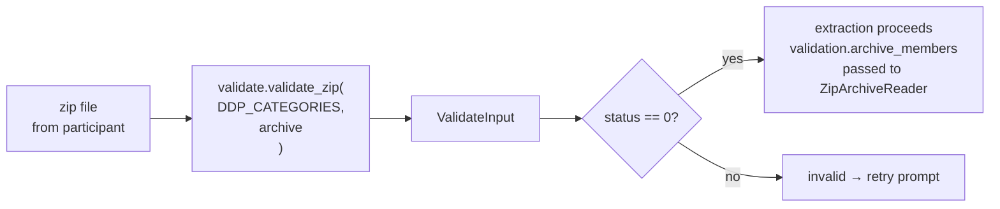

# Extraction

Extraction is the step where Python reads the participant's zip file, parses the files inside it, and produces tables for the participant to review. This happens entirely inside the browser — no data leaves the participant's device until they explicitly consent.

---

## Validation first

Before extraction starts, `FlowBuilder.start_flow()` calls `self.validate_file(archive)`. Validation answers: *is this the right kind of file?*



`validate_zip()` opens the zip and checks its file list against the platform's `DDP_CATEGORIES`. Each `DDPCategory` describes one known variant of the platform's export (e.g. English JSON, Dutch CSV). If enough of the expected files are present, validation passes and the file list is stored in `validation.archive_members`.

---

## ZipArchiveReader

`ZipArchiveReader` is the main tool for reading files from the zip. It is created with the archive (a `SeekableBinaryReader`), the file list from validation, and a shared `errors` Counter:

```python
reader = ZipArchiveReader(archive, validation.archive_members, errors)
```

Main methods:

| Method | Returns | Use for |
|---|---|---|
| `reader.json("file.json")` | `JsonExtractionResult` — `.data` is `dict \| list` | JSON files |
| `reader.csv("file.csv")` | `CsvExtractionResult` — `.data` is `pd.DataFrame` | CSV files |
| `reader.raw("file.raw")` | `RawExtractionResult` — `.data` is `io.BytesIO` | Files that need custom parsing |

All three result types have a `found: bool` field. If the file is not in the zip, `found` is `False` and no error is recorded. This is the standard way to handle optional files:

```python
result = reader.csv("Company Follows.csv")
if not result.found:
    return pd.DataFrame()   # file is missing, return empty table
return result.data
```

If a file is found but cannot be parsed (bad CSV, wrong encoding, etc.), `ZipArchiveReader` catches the exception, increments `errors[ExceptionType.__name__]`, and returns an empty result. Extraction continues with the other files.

**File:** `packages/python/port/helpers/extraction_helpers.py`

---

## The extraction pattern

Each platform has an `extraction()` function. It loads the config, creates a reader, runs all extractors, and returns the results:

```python
def extraction(zip_path: str, validation: ValidateInput) -> ExtractionResult:
    config = load_port_config(EXTRACTOR_REGISTRY, "myplatform")
    errors: Counter = Counter()
    reader = ZipArchiveReader(archive, validation.archive_members, errors)
    return run_extraction(reader, errors, config)
```

- `load_port_config` reads `configs/myplatform_config.json` and maps each table entry to an extractor function in `EXTRACTOR_REGISTRY`.
- `run_extraction` calls each extractor, applies any column filtering from the config, and returns only the non-empty tables.

Each extractor function has a simple shape — receive a reader and an errors counter, return a DataFrame:

```python
def connections_to_df(reader: ZipArchiveReader, errors: Counter) -> pd.DataFrame:
    result = reader.csv("Connections.csv")
    if not result.found:
        return pd.DataFrame()
    return result.data
```

The config file (`configs/myplatform_config.json`) holds the table titles, column headers, and visualizations. Generate it from the extractor docstrings:

```sh
pnpm generate-config myplatform
```

---

## ExtractionResult

`extract_data()` must return an `ExtractionResult`:

```python
@dataclass
class ExtractionResult:
    tables: list[PropsUIPromptConsentFormTableViz]
    errors: Counter = field(default_factory=Counter)
```

- `tables` — the data to show the participant in the consent form. Only non-empty tables are included.
- `errors` — a count of exception types that occurred during extraction (e.g. `{"KeyError": 2}`). No messages or tracebacks, only type names and counts.

`FlowBuilder.start_flow()` reads `result.errors` and sends a short summary to the host log: `"errors: KeyError×2, FileNotFoundInZipError×1"`.

---

## DDPCategory and known files

Each platform defines a list of `DDP_CATEGORIES`. A `DDPCategory` specifies:

- `id` — a short name (e.g. `"csv_en"`)
- `ddp_filetype` — `DDPFiletype.CSV`, `.JSON`, `.HTML`, etc.
- `language` — `Language.EN`, `.NL`, etc.
- `known_files` — a list of filenames expected in this export variant

Validation passes if enough of the `known_files` are present in the zip. If a platform exports in multiple formats (e.g. English JSON and Dutch HTML), define one `DDPCategory` per format. After validation, `validation.current_ddp_category` tells you which one matched.

---

## Key files

| File | Role |
|---|---|
| `packages/python/port/helpers/extraction_helpers.py` | `ZipArchiveReader`, `JsonExtractionResult`, `CsvExtractionResult`, `RawExtractionResult` |
| `packages/python/port/helpers/validate.py` | `ValidateInput`, `DDPCategory`, `validate_zip()` |
| `packages/python/port/helpers/table_extractor.py` | `TableConfig`, `load_port_config()`, `run_extraction()` |
| `packages/python/port/api/d3i_props.py` | `ExtractionResult`, `PropsUIPromptConsentFormTableViz` |
| `packages/python/port/platforms/example.py` | Complete example platform |
| `packages/python/port/configs/example_config.json` | Example config file |

---

→ [Logging](06-logging.md) — how extraction errors and milestones reach the host
