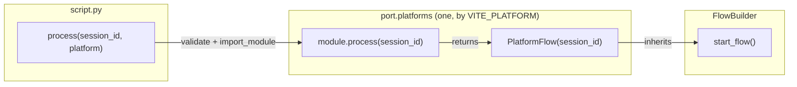
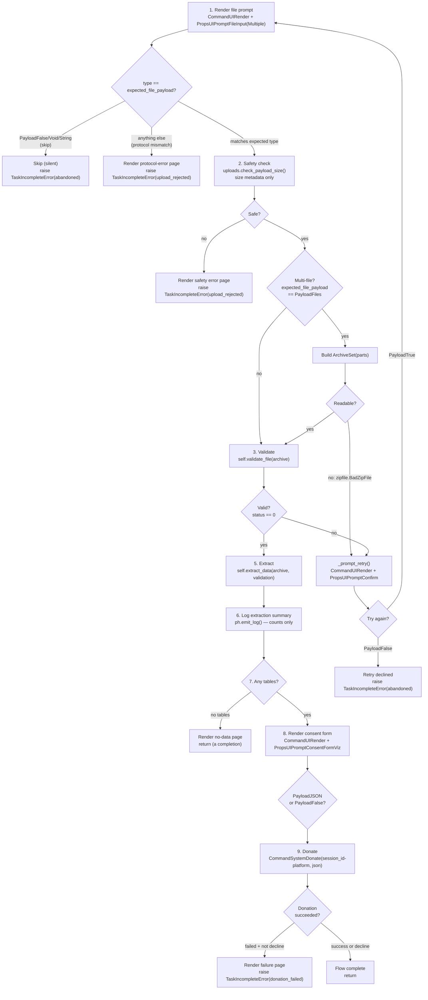

# FlowBuilder

`FlowBuilder` is the base class for every per-platform donation flow. It
owns the complete lifecycle of a single platform's donation: prompting for
a file, validating it, extracting data, presenting a consent form, and
donating the result.

**File:** `packages/python/port/helpers/flow_builder.py`

---

## How it fits in

`script.py` is the study-level orchestrator. Each build targets one platform
(selected by `VITE_PLATFORM`): `script.py` validates that platform's config,
imports `port.platforms.<platform>`, and calls `module.process(session_id)`,
which returns `<Platform>Flow(session_id).start_flow()`. There is no platform
registry and no iteration — a build runs a single platform.



---

## The flow

`start_flow()` is a generator that implements a fixed lifecycle. It loops
so the participant can retry file selection, and breaks out of the loop once
extraction succeeds. What the upload arrives as depends on
`expected_file_payload` (see below): for the default single-file flow it is
a `PayloadFile` whose value is an `AsyncFileAdapter` — a seekable file-like
passed directly to validation and extraction, never materialized to a path.
A subclass that opts into the multi-file flow instead receives a
`PayloadFiles` whose value is a list of such readers, which `start_flow()`
unions into one `ArchiveSet` before validation (see ADR-0040).



### `expected_file_payload` — opting into a multi-file platform

`FlowBuilder.expected_file_payload` defaults to `"PayloadFile"` (single-file
upload). A platform whose export arrives as several files that must be
treated as one archive — a chunked Google Takeout export is the motivating
case — sets `expected_file_payload = "PayloadFiles"` on its subclass. This
one attribute drives three things:

- `generate_file_prompt()` passes `multiple=True`, so the participant sees
  the multi-select file input (`FileInputMultiple`) instead of the
  single-file one.
- Step 1's gate becomes a three-way branch instead of a boolean: the
  response's `__type__` must equal `expected_file_payload` exactly to
  proceed. `PayloadFalse` / `PayloadVoid` / `PayloadString` are the
  established participant-declined shapes (pinned by ADR-0026) and stay a
  silent skip — no error page, though still a non-completion, so the skip
  raises `TaskIncompleteError("abandoned")` (ADR-0039). Anything else is a
  genuine protocol mismatch (host/Python version skew, not a decline) and
  gets a visible `render_protocol_error_page(platform_name)` instead of
  silently hanging or crashing, followed by
  `TaskIncompleteError("upload_rejected")` — nothing usable was uploaded, so
  the run must not exit 0.
- When `expected_file_payload == "PayloadFiles"`, `start_flow()` builds
  `archive = ArchiveSet(parts)` from the uploaded readers right after the
  safety check, and passes that `ArchiveSet` — not a single reader — to
  `validate_file()`/`extract_data()`. `ArchiveSet` raises
  `zipfile.BadZipFile` if any part is unreadable; `start_flow()` catches
  that and routes it through the same retry prompt an invalid single file
  uses, rather than raising. Declining that retry is an abandonment like any
  other: `TaskIncompleteError("abandoned")`, never a completion.

A single-file platform (the common case) never has to think about any of
this — `expected_file_payload` simply keeps its default.

### `_prompt_retry()` — two entry causes, one prompt

`_prompt_retry()` is a small generator helper: it renders the retry
confirm prompt and returns `True` (retry — caller `continue`s the outer
loop) or `False` (declined — caller raises
`TaskIncompleteError("abandoned")`). Two different failures
share it rather than each rendering their own prompt:

1. `validate_file()` returned a non-zero status code (an invalid single
   file, or an `ArchiveSet` whose members didn't match the platform).
2. `ArchiveSet(parts)` raised `zipfile.BadZipFile` because one of the
   uploaded parts wasn't a readable zip (multi-file flow only).

Both land the participant on the same "Try again?" prompt; from the
participant's point of view, a corrupt part and an invalid file are the
same recoverable mistake.

### Safety check

`uploads.check_payload_size(file_result)` is metadata-only (JS-reported
`.size`, never a read) and raises one of two exception types depending on
shape: `FileTooLargeError` for a single file over the per-file cap, or
either `FileTooLargeError` (aggregate size) or `TooManyFilesError` (member
count) for a `PayloadFiles` set. `start_flow()` catches both:

```python
except (uploads.FileTooLargeError, uploads.TooManyFilesError) as e:
```

There is no exact-size sentinel value anywhere in this path — a truncated
or corrupt archive is caught downstream by zip validation (routing to
`_prompt_retry()`), not by comparing against a magic size.

---

## Emit log milestones

`start_flow()` calls `ph.emit_log()` at each significant step. These are the
messages that appear in the host's log stream. They are always PII-free —
platform name, status code, and counts, never participant data.

| Step | Log message |
|---|---|
| Upload prompt sent | `[Platform] Upload prompt sent` |
| Upload received (single file) | `[Platform] Upload received: size=N` |
| Upload received (multi-file) | `[Platform] Upload received: files=N total_size=X` |
| Upload skipped | `[Platform] Upload skipped: type=PayloadFalse` |
| Protocol mismatch | `[Platform] Protocol mismatch: expected=PayloadFile got=PayloadJSON` |
| Safety check failed | `[Platform] Safety check failed: FileTooLargeError` |
| Validation passed | `[Platform] Validation: valid (category_id)` |
| Validation failed | `[Platform] Validation: invalid` |
| Extraction complete | `[Platform] Extraction complete: N tables, M rows; errors: ErrorType×count` |
| Consent form shown | `[Platform] Consent form shown` |
| Consent accepted | `[Platform] Consent: accepted` |
| Consent declined | `[Platform] Consent: declined` |
| Donation started | `[Platform] Donation started: payload size=N bytes` |
| Donation result | `[Platform] Donation result: success/failed` |

---

## Implementing a platform

Subclass `FlowBuilder` and implement two methods:

```python
class LinkedInFlow(FlowBuilder):
    def __init__(self, session_id: str):
        super().__init__(session_id, "LinkedIn")  # sets self.platform_name

    def validate_file(self, file) -> validate.ValidateInput:
        return validate.validate_zip(DDP_CATEGORIES, file)

    def extract_data(self, file, validation: validate.ValidateInput) -> ExtractionResult:
        return extraction(file, validation)
```

- `validate_file(archive)` — returns a `ValidateInput`. Status 0 = valid; non-zero = invalid.
  `archive` is the upload adapter (seekable file-like), not a path.
- `extract_data(archive, validation)` — returns an `ExtractionResult`. Can also be a generator
  (`yield from`) if you need to yield intermediate commands during extraction.

Everything else — the file prompt, the retry loop, the consent form, the
donation, the logging — is handled by `start_flow()`.

A multi-file platform sets `expected_file_payload = "PayloadFiles"` and
narrows both overrides' `archive` annotation to `ArchiveSet` — see
`port/platforms/e2etest_multifile.py` for a minimal working example that reads
through `ZipArchiveReader(archive_set, validation.archive_members, errors)`
exactly like a single-file platform would over a plain reader.

---

## UI text

`FlowBuilder.__init__()` calls `_initialize_ui_text()`, which builds a dict
of `Translatable` strings for the file prompt header, consent form header,
retry header, and review description. These are constructed from
`self.platform_name` so they automatically use the platform name you pass to
`super().__init__()`.

Override `_initialize_ui_text()` or modify `self.UI_TEXT` after `super().__init__()`
if you need custom text.

---

## Key files

| File | Role |
|---|---|
| `packages/python/port/helpers/flow_builder.py` | `FlowBuilder` base class |
| `packages/python/port/script.py` | `process()` — loads and starts the one platform selected by `VITE_PLATFORM` (no registry, no iteration) |
| `packages/python/port/platforms/linkedin.py` | Example single-file platform implementation |
| `packages/python/port/platforms/e2etest_multifile.py` | Minimal multi-file (`PayloadFiles`/`ArchiveSet`) platform implementation |
| `packages/python/port/helpers/archive_set.py` | `ArchiveSet`, `ArchiveSource`, `SingleArchiveSource` |
| `packages/python/port/helpers/port_helpers.py` | `emit_log`, `render_page`, `donate`, `render_protocol_error_page` helpers |

---

→ [Extraction](05-extraction.md) — how `extract_data()` works inside a platform
