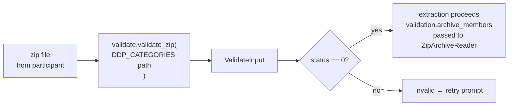

# Extraction

Extraction is the step where Python reads the participant's DDP (Data Donation
Package), parses the files it needs, and produces a set of tables for the
participant to review. This happens entirely inside the Pyodide WebWorker —
no data leaves the browser until the participant explicitly consents.

---

## Validation first

Before extraction begins, `FlowBuilder.start_flow()` calls `self.validate_file(path)`.
Validation answers: *is this the right kind of file?*



`validate_zip()` opens the zip and inspects its file list against a platform's
`DDP_CATEGORIES` — a list of `DDPCategory` objects, each specifying an expected
set of filenames, language, and file type. If enough known files are present,
status 0 is set and `validation.archive_members` is populated with the full
member list.

---

## ZipArchiveReader

`ZipArchiveReader` is the main tool for reading files out of a validated zip.
It is constructed with the uploaded archive — a seekable file-like object
(the upload adapter in production, `io.BytesIO` in tests) for a single-file
platform, or an `ArchiveSet` for a multi-file platform (see below) — the
member list from validation, and a shared `errors` Counter:

```python
reader = ZipArchiveReader(linkedin_zip, validation.archive_members, errors)
```

It provides four methods:

| Method | Returns | Use for |
|---|---|---|
| `reader.json("filename.json")` | `JsonExtractionResult` with a parsed `dict`/`list` | JSON files |
| `reader.json_all(r"pattern.*\.json")` | `list[JsonExtractionResult]`, sorted by member path | Paginated JSON exports (`_1.json`, `_2.json`, …) |
| `reader.csv("filename.csv")` | `CsvExtractionResult` with a `pd.DataFrame` | CSV files |
| `reader.raw("filename.csv")` | `RawExtractionResult` with `io.BytesIO` | Files needing pre-processing before parsing |

Each result carries a `found: bool` field. If the file is not in
the zip, `found` is `False` and no error is recorded. This is the standard
pattern for optional files:

```python
result = reader.csv("Company Follows.csv")
if not result.found:
    return pd.DataFrame()   # silently skip
return result.data
```

When a file is found but cannot be parsed (malformed CSV, encoding error, etc.),
`ZipArchiveReader` catches the exception, increments `errors[ExceptionType.__name__]`,
and returns an empty `DataFrame`. This keeps extraction running even when
individual files fail.

**File:** `packages/python/port/helpers/extraction_helpers.py`

---

## Multi-file archives: ArchiveSet

A platform whose export can arrive as several files (a chunked Google
Takeout export is the motivating case) sets `expected_file_payload =
"PayloadFiles"` on its `FlowBuilder` subclass (see
[FlowBuilder](04-flowbuilder.md)). `start_flow()` then unions the uploaded
parts into one `ArchiveSet` before validation, and that `ArchiveSet` — not
a single reader — is what reaches `validate_file()`/`extract_data()` and
gets passed into `ZipArchiveReader`. Extractor code does not need to know
whether it is reading one zip or several: `ZipArchiveReader` accepts either
shape.

**File:** `packages/python/port/helpers/archive_set.py`

| Name | Role |
|---|---|
| `ArchiveSource` (protocol) | `.members: list[str]` + `.read_member(path) -> bytes` — the shape `ZipArchiveReader` accepts alongside a plain seekable reader |
| `SingleArchiveSource` | Wraps one already-validated archive in the `ArchiveSource` shape (the single-file path, used internally) |
| `ArchiveSet` | N uploaded parts presented as one archive: one union member inventory, on-demand per-part reads |

`ArchiveSet` orders its parts canonically by `(name, size)` — both
JS-reported metadata, never a byte read and never upload/selection order —
so member resolution is deterministic regardless of how the parts were
picked. The member inventory is the union of every part's namelist, sorted
by member path; canonical part order is separate from that listing order
and decides which part owns a path duplicated across parts — the first
part to declare a path, in canonical order, owns it. Exact-duplicate
members are counted, not silently dropped or treated as fatal, in two
distinct `Counter` keys so neither inflates the other:
`DuplicateMemberAcrossParts` (an earlier part already owns this path — e.g.
an overlap file repeated across two consecutive Takeout parts) and
`DuplicateMemberWithinPart` (the zip format's legal same-path-twice inside
one part's own central directory). `ZipArchiveReader` merges
`archive.duplicates` into its `errors` Counter automatically, so these show
up in the same extraction-summary log line as any other error type.
Constructing an `ArchiveSet` raises `zipfile.BadZipFile` if any part isn't a
readable zip; `FlowBuilder.start_flow()` catches that and routes it to the
retry prompt (see ADR-0040).

### The materialization-time member guard

`MAX_MEMBER_UNCOMPRESSED_BYTES` (in `port/helpers/uploads.py`) bounds a
single member's uncompressed size, checked from the zip's central-directory
`file_size` *before* decompressing — inside `ArchiveSet.read_member()` /
`SingleArchiveSource.read_member()`, i.e. at the moment a member is actually
read, never earlier. This is deliberately separate from the upload-level
safety check (`uploads.check_payload_size()`, metadata-only, aggregate size
and file count — see [FlowBuilder](04-flowbuilder.md)): that check runs
before any zip is even opened, while this guard runs per-member, at read
time, and raises `MemberTooLargeError` for a decompression-bomb-sized
member. `ZipArchiveReader` catches it the same way it catches any other
read exception — records it in `errors`, returns an empty result — so one
oversized member does not abort the rest of extraction.

---

## ExtractionResult

`extract_data()` must return an `ExtractionResult`:

```python
@dataclass
class ExtractionResult:
    tables: list[PropsUIPromptConsentFormTableViz]
    errors: Counter = field(default_factory=Counter)
```

- `tables` — the data to show the participant in the consent form. Each table
  has an `id`, a `title`, a `data_frame`, and optional `description`,
  `visualizations`, and `headers`.
- `errors` — a `Counter` of exception type names. Keys are class names only
  (e.g. `"KeyError"`, `"FileNotFoundInZipError"`); no messages, no tracebacks.

`FlowBuilder.start_flow()` reads `result.errors` after extraction and formats
it into a PII-free log message: `"errors: KeyError×3, FileNotFoundInZipError×1"`.

---

## The extraction pattern

Table metadata (id, title, description, headers, visualizations) does **not**
live in `extraction()`. It lives in each extractor function's docstring as a
`Table config::` / `Table documentation::` block, from which
`scripts/generate_port_config.py` generates `configs/<platform>_config.json`
(AST-parsed, no Pyodide import). At runtime, `extraction()` loads that config and
builds the tables from it — never from inline literals:

```python
def extraction(reader: ZipArchiveReader) -> ExtractionResult:
    config = load_port_config(EXTRACTOR_REGISTRY, "linkedin")
    return run_extraction(reader, reader.errors, config)
```

`load_port_config` reads the generated JSON; `run_extraction` runs each
configured extractor and builds a `PropsUIPromptConsentFormTableViz` from the
config values (`table_cfg.title`, `table_cfg.headers`, …). Each extractor
receives the shared `errors` Counter so it can record failures without
interrupting the others, and empty tables are filtered out before the consent
form is shown.

Metadata edits happen in the extractor's docstring (then regenerate) or in the
curated config JSON, which is the source of truth after generation — the
generator refuses to overwrite an existing config. (See `EXTRACTOR_REGISTRY` and
the standard platform interface in `04-flowbuilder`.)

---

## DDPCategory and known files

Each platform defines a list of `DDP_CATEGORIES`. A `DDPCategory` specifies:

- `id` — a string identifier (e.g. `"csv_en"`)
- `ddp_filetype` — `DDPFiletype.CSV`, `.JSON`, `.HTML`, etc.
- `language` — `Language.EN`, `.NL`, etc.
- `known_files` — a list of filenames expected in this DDP variant

Validation succeeds if a sufficient proportion of `known_files` are present
in the zip. If a platform exports in multiple formats (e.g. English JSON,
Dutch HTML), define multiple `DDPCategory` entries and validation picks the
matching one. `validation.current_ddp_category` tells you which category matched.

---

## Key files

| File | Role |
|---|---|
| `packages/python/port/helpers/extraction_helpers.py` | `ZipArchiveReader`, `JsonExtractionResult`, `CsvExtractionResult`, `RawExtractionResult` |
| `packages/python/port/helpers/archive_set.py` | `ArchiveSet`, `ArchiveSource`, `SingleArchiveSource`, `MemberTooLargeError` |
| `packages/python/port/helpers/validate.py` | `ValidateInput`, `DDPCategory`, `validate_zip()` |
| `packages/python/port/api/d3i_props.py` | `ExtractionResult`, `PropsUIPromptConsentFormTableViz` |
| `packages/python/port/platforms/linkedin.py` | Complete single-file example extraction implementation |
| `packages/python/port/platforms/e2etest_multifile.py` | Minimal multi-file (`ArchiveSet`) extraction implementation |

---

→ [Logging](06-logging.md) — how extraction errors and milestones reach the host
